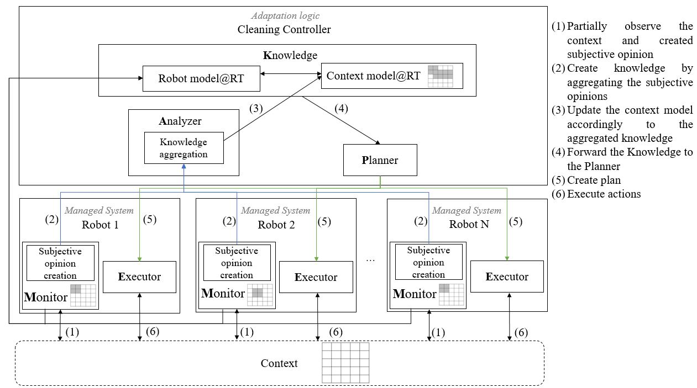
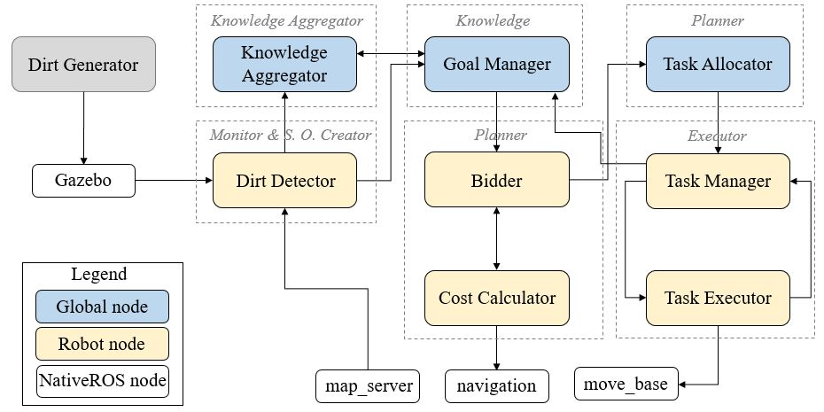

# Knowledge Aggregation with Subjective Logic in Multi-Agent Self-Adaptive Cyber-Physical Systems

This repository contains the source code and resources to perform Knowledge Aggregation with Subjective Logic in a ROS-based simulation of Self-Adaptive multi-robot system.

# Use-case description [Ana update]
For this implementation we consider the following reference problem.

In a robotics system, two robots or more are charged with the task of cleaning a perpetually, randomly appearing dirt in a set of locations in a room. The robots are aware of each other, meaning that they perceive the other as an obstacle while moving in the environment. Through sensor readings, in particular LIDAR scanning, the robots detect the dirt that has been appeared in the room. The detection of the dirt and its accuracy depends on the limited range of the robot’s sensors.

The context is modeled as a global, centralized grid map with size equal to the size of the room. Each cell in the grid is occupied either by an static obstacle (walls, furniture, etc.) or dynamic obstacles, i.e. the robots and the newly appeared dirt. As mentioned before, the operation of the robots is limited by its sensor capabilities, meaning that the robots only hold a partial observation of the context at a given point in time. As the robots move in the room, that partial observation is communicated and gathered in the centralized grid map, where the multiple observations are aggregated to produce a new, common, global knowledge about the environment.

The system should exhibit self-adaptive features while pursuing its mission goal of keeping the room clean. For instance, they could aggregate their knowledge to adapt to collaborative behavior and deal, for example, with situations when specific places in the room get dirtier than others. Nonetheless, even after cumulating the robots’ observations, the accuracy of the perceived context is not reliable due to sensor uncertainties, such as noise, ambiguity and imprecision, and failure in the robots’ sensors. Therefore, the aggregation of knowledge should take into account and decrease the uncertainties in its observations.

Additionally, due to the partially observable context of each robot and their related uncertainties, conflicting robots’ opinions about the same perceived context situation may arise, hindering the system’s adaptation. Again, the knowledge aggregation should provide mechanisms to resolve such conflicts.

### Overview of the approach

Ana TODO add a short description of the approach




# Implementation high-level architecture of the system

The following figure shows the implementation architecture of our robotics system. 




The architecture consists of a combination of ROS nodes, classified as:

* **Global nodes.** Implemented nodes executed within ROS, which expose the functionality of the *Cleaning Controller*.
* **Robot nodes.** Implement the essential logic that makes use of the robots' resources to perform the defined tasks.
* **Native ROS nodes.** These are preexisting nodes in the ROS stack, providing a wide range of functionality that serves as the building blocks of a robotic system.

## ROS nodes/packages
Below we provide a brief description of each node's functionality and a link to the corresponding ROS package.

* [Dirt Generator](../ros/src/dirt_generator): generates random dirt tasks in the simulation map
* [Knowledge aggregator](../ros/src/goal_manager): performs the aggregation of the robots' observations
* [Dirt Detector](../ros/src/dirt_detection): uses the robot's laser sensors to detect dirt in the map
* [Goal Manager](../ros/src/goal_manager): manages the new and completed dirt tasks
* [Bidder](../ros/src/bidder): calculates the cost of tasks and bid for the assignment of a goal  
* [Task Allocator](../ros/src/task_allocator): manages and assign dirt goals to the robots 
* [Task Manager](../ros/src/task_manager): manages the individual goals of a robot
* [Task Executor](../ros/src/task_executor): handles the goals assign to the robot

# Setting up the system 

## Prerequisites 


Before setting up and running the use cases make sure that:

* You are using **Ubuntu 18.04** 
* You have **Java** installed. Follow the [Java installation](../subjective_logic/Installing Java.md) instructions to set up Java in your system.
* **Python 2.7 and 3.6** working environments installed. Please, make sure that you have `pip` package installer in both environments, this will be useful to install other system dependencies.
* **ROS** Melodic and **Gazebo** simulator are installed and running properly.  If this is not the case, refer to the following instructions in [Installing ROS and Gazebo](### Installing ROS and Gazebo).


## The rest of the README is structured in three major segments: 

1. Installing the required packages necessary for running the system
2. Installing the system / cloning the source code
3. Running the simulation and the system

## 1. Installing the required packages necessary for running the system

### Installing ROS and Gazebo
To install ROS, you may want to follow the [official installation istructions](http://wiki.ros.org/melodic/Installation/Ubuntu). We recommend to use the full-desktop distribution of ROS, since it installs the needed Gazebo resources.

Additionally, you need to install the navigation stack, turtlebot3 ROS packages and rospkg Python module. Use the following commands to install these packages:
 - Navigation stack: `sudo apt install ros-melodic-navigation`
 - Turtlebot3: `sudo apt install ros-melodic-turtlebot3`
 - rospkg: `pip install rospkg`. Install this package in both Python2 and Python3 environments.


If you want to install only the simulator, then follow the [official documentation](http://gazebosim.org/tutorials?tut=ros_installing&cat=connect_ros). 

## 2. Installing the system / cloning the source code

### Python packages

Some nodes have dependencies on the Python packages:
 - numpy
 - scipy
 - empy
 - bresenham
 - dataclasses

If these packages are missing in your environment, install them using `pip install <pkg_name>`for both Python 2.7 and 3.6.

### Bridging the Subjective Logic library using jpy

Knowledge aggregation is performed using a Subjective Logic library implemented in Java (the source code of the library can be found in the [Subjective Logic library directory](../subjective_logic)). Since our ROS nodes are written in Python, we need a Java-Python bridge to use such library.

jpy is a Python-Java bridge which you can use to embed Java code in Python programs or vice versa. To install jpy, follow the instructions under [Installing jpy](../subjective_logic/README.md#Installing jpy#Installing jpy) section.

## 3. Running the simulation and the system

### Building and sourcing ROS packages

For convenience, we recommend to source your ROS environment and the testbed workspace by adding the following lines to your .bashrc file:
```
source /opt/ros/melodic/setup.bash
source /path/to/workspace/devel/setup.bash
```

Since we are using turtlebot3 Burger for simulation, we need to add the respective environment variable:
```
export TURTLEBOT3_MODEL=burger
```

ROS melodic is built to work with Python 2.7 by default, and our implementation consists of nodes written in both Python 2.7 and 3.6, therefore, we need to add the ROS environment variable defining the use of Python 2.7
```
export ROS_PYTHON_VERSION=2
```
  

To build the testbed ROS packages:
1. Use git to clone this repository
2. Go to the project workspace root directory
3. Execute `catkin_make -DCMAKE_BUILD_TYPE=Release` 

### Configuration parameters

In order to change the simulation behavior, we need to configure the following parameters:
 - `use_sl`. This parameter enable/disable the use of knowledge aggregation. By default this feature is enabled.
 - `sl_operator`. Set the kind of operator to be used for knowledge aggregation. Possible values are:
   - `CBF` for Cumulative Belief Fusion
   - `CCF` for Consensus & Compromise Fusion
 - `sl_threshold`. Threshold used by the analyzer to decide when the detected dirt should be considered as a goal to be assigned to one of the participating robots. 
 - `sl_classpath`. Path where to look for the subjective library JAR file. *The final classpath string **must** include the prefix "-Djava.class.path="*
 - `adaptive_scheduling`. Enable/disable the use of adaptation logic in the simulation. By default, self-adaptation is enabled.
 - `gen_seed`. Seed to be used to generate random locations where to spawn a new task. The default seed is 100.
 - `spawn_interval`. Time interval (in seconds) to create a new task. The default interval is 10s

This parameters are set accordingly in the launch or config files in the following sections.

It is recommended that the `sl_classpath` is set in the `.launch` files in the `ros/test/` directories as described in the `subjective_logic` README file. Once this is set one must not inclunde this parameter when running the simulation.

### Run the simulation using launch files
By using roslaunch tool we can set directly the above mentioned parameters. For example, to simulate a scenario with 2 robots with knowledge aggregation enabled using Cumulative Belief Fusion, and spawn interval of 10s, we could execute the following command in a terminal, assuming the `sl_classpath` has been set in the `.launch` files:

```
roslaunch master.launch use_sl:=true sl_operator:=CBF adaptive_scheduling:=true gen_seed:=100 spawn_interval:=10
```

For convenience, bash scripts for different test scenarios are provided in the directory [test](../ros/test) of this repository. These assume, that the `sl_classpath` has been set in the `.launch` files.

These scripts make use of the launch files contained in the [test](../ros/test) directory,  and the [robot_meta](../ros/src/robot_meta) and [launch_simulation](../ros/src/launch_simulation) ROS packages. If we were to add more robots in the simulation, their initial position, or the robot's simulation descriptors, we need to change these values manually in the corresponding launch file.

**Important**. Whether you use directly the `roslaunch` command or the launch scripts, you may see the current execution logs on the terminal. With the current implementation, when the Goal Manager node is launched, you may see the exception *`AttributeError: 'KnowledgeAggregator' object has no attribute 'occupancy_map'`*. This error is a known issue while starting the node, and will disappear when the needed ROS topics are published; more details about this exception are given in the [Goal manager](../ros/src/goal_manager) documentation.

#### `master.launch` file
This is the main launch file being used to start the simulation. The script defines the parameters that must be provided to configure the simulation and these parameters in turn, are then passed as arguments to the other launch files and/or for launching the global ROS nodes.

Of particular importance, is in this file where we define the number of robots to be used in the simulation, as well as their initial properties. To add a new robot in the simulation, add the following lines at the beginning of the file:

```
<arg name="robot_0_name" default="robot_0"/>
<arg name="robot_0_x_pos" default="-4.0"/>
<arg name="robot_0_y_pos" default="4.5"/>
<arg name="robot_0_z_pos" default="0.0"/>
<arg name="robot_0_yaw" default="0.0"/>
```

Make sure to update the name of the launch arguments accordingly.

Also update the argument defining the number of robots:

```
<arg name="no_of_robots" default="2"/>
```

In order to launch the robots' nodes, the `master.launch` makes use of the [robot_meta](../ros/src/robot_meta) launch file. Include a call to this launch file and update the needed arguments accordingly as many times as robots you are using for the simulation:

```
    <include file="$(find robot_meta)/launch/robot_meta.launch">
        <arg name="robot_id" value="$(arg robot_1_name)"/>
        <arg name="x" value="$(arg robot_1_x_pos)"/>
        <arg name="y" value="$(arg robot_1_y_pos)"/>
        <arg name="yaw" value="$(arg robot_1_yaw"/>
        <arg name="bid_topic" value="/bid"/>
        <arg name="new_goal_topic" value="/new_goal"/>
        <arg name="confirmation_topic" default="/confirmation"/>
        <arg name="noise" value="$(arg sensor_noise)"/>
        <arg name="adaptive_scheduling" value="$(arg adaptive_scheduling)"/>
        <arg name="false_positive" value="true"/>
        <arg name="false_positive_prob" default="$(arg false_positive_prob)"/>
    </include>
```

Finally, the last part of the launch file is in charge of launching all the global nodes, passing all the parameters needed to initialize such nodes.

#### `robot_meta.launch` file
This launch file is in charge of launching all the robots' nodes and should be called as many times as robots are considered in the simulation. Additionally, all the AMCL navigation and map server nodes are launch here.

In [robot_meta](../ros/src/robot_meta) ROS package you will find maps and configuration files used by this launch file.
  
### Simultaneous simulations

To be able to execute various simulation runs simultaneously, you can modify the following lines in the corresponding *.sh script to change the ports in which `roscore` and `gazebo` instances will listen for pub/sub messages.

```
export ROS_MASTER_URI=http://localhost:11315
export GAZEBO_MASTER_URI=http://localhost:11335
```
You may find additional information about this configuration in [How to run multiple Independent Gazebo instances on the same machine?](https://answers.ros.org/question/193062/how-to-run-multiple-independent-gazebo-instances-on-the-same-machine)

The simulations for the thesis and SEAMS paper were executed running 3 to 5 simultaneous runs on the same PC. A side effect of running various simultaneous runs, is that we observed an increase in simulation runtime.   

